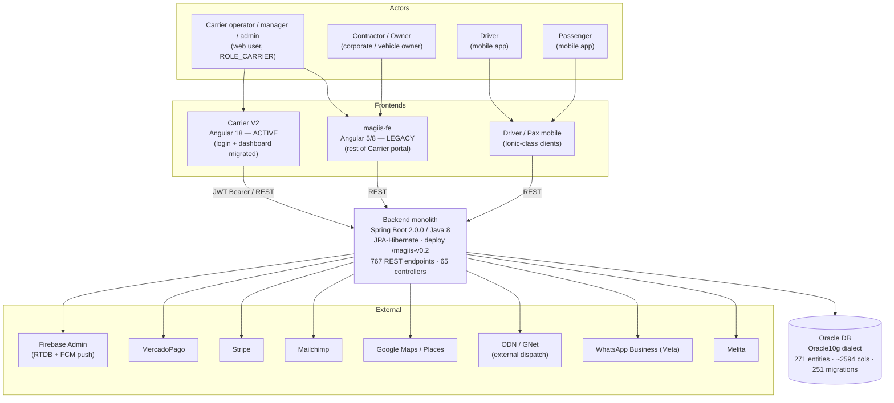
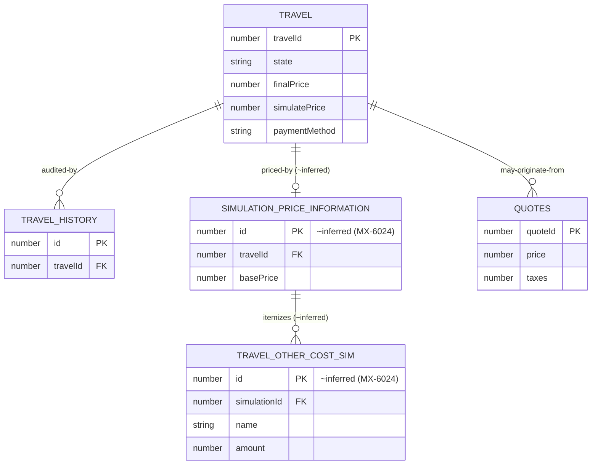

# SRS — Architecture · MAGIIS Carrier

> **Reverse-engineered, read-only survey (2026-07-13).** Reconstructed from on-disk
> automation-repo artifacts + embedded application source. No live backend Java source was
> read (see [Discovery Gaps](#discovery-gaps)). Every claim below cites its source file.
>
> **Sources**
> - `magiis-api-e2e/docs/reference/backend-endpoints-v1.72.2.md` — backend contract truth (stack, controllers, entities, tables, jobs, auth). Abbrev: **[BE-DOC]**
> - `magiis-api-e2e/docs/ARCHITECTURE.md` — suite + system layering. Abbrev: **[SUITE-ARCH]**
> - `magiis-api-e2e/scripts/backend-route-catalog.json` — controller→route inventory, source-derived. Abbrev: **[ROUTE-CAT]**
> - `magiis-carrier-v2-e2e/refs/v2/src/app/**` — active Carrier V2 frontend (Angular 18). Abbrev: **[FE-V2]**
> - `magiis-carrier-v2-e2e/docs/analysis/COMPARISON-V1-V2.md` — V1↔V2 delta. Abbrev: **[V1V2]**
> - Aligned with `.context/business/domain-glossary.md` and `.context/infrastructure/frontend.md` (vocabulary; not duplicated here).

---

## System Context

MAGIIS is a mobility / dispatch platform. The **Carrier portal** is the operator-facing web
application (fleet, trips, drivers, vehicles, fares, settlements, checking accounts, GNET,
affiliates). All frontends and mobile apps talk to a **single Spring Boot monolith backend**
(`magiis-v0.2` deploy path) backed by **Oracle** [BE-DOC L17].



Sources: monolith + stack + endpoint/controller counts [BE-DOC L17-19]; central Oracle tables
[BE-DOC L38-41]; external integrations [BE-DOC L100-103]; Carrier V2 = active / V1 = legacy
[FE-V2 `frontend.md` L3, L17-20][V1V2 L36-41]; `RoleToAttempt: ROLE_CARRIER` login
[`.context/infrastructure/frontend.md` L23]. Mobile driver/pax inferred from the
`DriverAccountController` / `PassengerUserController` surfaces [ROUTE-CAT] and the MAGIIS domain
profile — no mobile source on disk (gap).

---

## Container / Component Structure

### Backend — monolithic Spring Boot

- **Stack**: Spring Boot 2.0.0, Java 8, JPA/Hibernate, Oracle (Oracle10g dialect) [BE-DOC L17].
- **Surface**: 767 REST endpoints across 63 controllers per the v1.72.2 doc [BE-DOC L18];
  the source-derived route catalog reports **65 controllers / 787 endpoints** (ground truth,
  `catalog:from-be`) [ROUTE-CAT `_meta`; BE-DOC L76]. Verb split: GET 48% / POST 29% / PUT 19% /
  DELETE 4% [BE-DOC L25-30].
- **Layering**: Controller (`@*Mapping`) → Service → JPA Repository → Oracle. 259 repositories,
  18 `@Scheduled` jobs [BE-DOC L19-20].
- **Highest-surface controllers (business core)**: `TravelController` (78), `CarrierAccountController`
  (73), `PassengerUserController` (54), `DataController` (28), `AdminUserController` /
  `DriverAccountController` (23 each), `BillingController` (24), `MagiisAccessController` (20)
  [ROUTE-CAT; BE-DOC L34-36].

Controllers grouped by domain (from [ROUTE-CAT] controller keys):

| Domain | Controllers |
|---|---|
| Travel / Trips | `TravelController` (78), `TravelProcessesController`, `RecurringTripController`, `QuoteController`, `FlightsController`, `MapperController` |
| Carrier accounts & config | `CarrierAccountController` (73), `CarrierAccountSolicitudeController`, `CarrierUserController`, `CarrierAreasController`, `CarrierZoneController`, `CarrierServiceTypesController`, `CarrierRateController`, `CarrierConceptTaxController`, `CarrierOtherCostController`, `SpecialRateTriggerController`, `OperationCharacteristicController` |
| Drivers / Vehicles / Owners | `DriverAccountController`, `DriverUserController`, `VehicleController`, `VehicleOwnerController`, `TransportController`, `OwnerPortalController` |
| Clients / Contractors | `ClientController`, `ContractorAccountController`, `ContractorUserController`, `ContractorEmployeeController`, `ContractorAreaController`, `CostCenterController`, `ContractorAccountSolicitudeController`, `AbleToUseContractorController` |
| Billing / Settlement / Liquidation | `BillingController` (24), `CarrierContractorLiquidationController`, `CarrierDriverLiquidationController`, `CarrierOwnerLiquidationController`, `CarrierUserLiquidationController`, `CheckingAccountController`, `PaymentController`, `CardController`, `VendorController` |
| Affiliates (eAfiliado / ATC) | `AffiAgreementController`, `AffiCheckingAccountController`, `AffiOSTravelController`, `AffiliateProfileController` |
| GNet / external dispatch | `ODNController`, `MultiRegionController` |
| Integrations | `ApiIntegrationController`, `MailchimpEmailController`, `WhatsappBusinessIntegrationController`, `AIController`, `MagiisServicesCostController` |
| Reports / Dashboard / Data | `DashboardController`, `DataController` (28), `ContractorContractorRelationController` (`CarrierContractorRelationController`), `PlacesController` |
| Admin / Access / Platform | `AdminUserController`, `MagiisAccessController`, `UserController`, `UserTrailController`, `MagiisEmergencyController`, `ConfigController`, `VersionsController`, `TestController`, `BaseController`, `PassengerUserController`, `DriverAccountController` |

> Grouping is derived from controller name prefixes in [ROUTE-CAT]; the doc's own "domain"
> tables live in the (not-on-disk) `backend-endpoints-v1.72.2.full.md` [BE-DOC L8-10] — treat
> the grouping as inferred, not as the backend's declared package layout (gap).

### Frontend — Carrier V2 (Angular 18)

- **Runtime**: Angular 18.0.4, NgModule-based (no standalone), Angular Material 16, TS ~5.4,
  zone.js 0.14 [`.context/infrastructure/frontend.md` L6].
- **Routing**: `RouterModule.forRoot(routes, {useHash: true})` — **hash-routed**, lazy
  `loadChildren`; root guarded by `NeedLoggin`, `auth/*` lazy-loads `AccountModule`, the Carrier
  shell lazy-loads `CarrierModule` [FE-V2 `app-routing.module.ts`]. Deploy under base href
  `/carrier/` [V1V2 L18, L31].
  > Note: `.context/infrastructure/frontend.md` L26 flagged a PathLocationStrategy-vs-hash
  > discrepancy; the V2 root router source resolves it — code **does** use `useHash: true`.
- **Carrier feature routes** (`pages/carrier/carrier.routing.ts`): `dashboard`, `map-viewer`,
  `travel/{create,detail/:id,quotes,dashboard,recurring,mappers}`, `client/{list,contractors,...}`,
  `pay/*`, `liquidations/{contractors,passenger,drivers,owners}/*`, `checking-accounts/*`,
  `vehicle/*`, `owner/*`, `driver/*`, `reports/*` (18 report screens), `affiliate/*`, `gnet/*`,
  `integrations/*`, `settings/*`, `melita/ai-branches` [FE-V2 `carrier.routing.ts` L472-785].
- **Migration state (critical for QA)**: only **login + dashboard** are migrated/active in V2;
  the rest of the Carrier portal still runs on V1 (Angular 5/8). ~90 API command classes are
  wired but have no V2 UI yet [`.context/infrastructure/frontend.md` L18-20][V1V2 L36-41].

#### Command-pattern service layer

Each API operation is a class extending `IRequestCommand<Response, ErrorDetails, Params>` that
declares a `_commandType` (verb), a templated `_commandUrl`, and a typed params interface; DTO
interfaces live at `services/.../connection/interfaces/apiInterfaces.d.ts`
[FE-V2 `apiInterfaces.d.ts` paths]. Examples:

```mermaid
classDiagram
    class IRequestCommand~Res_Err_Params~ {
        +_commandType : CommandRequestType
        +_commandUrl : string
        +setParameters(params) void
    }
    class AddTravelCommand {
        _commandType = POST
        _commandUrl = "carriers/{carrierUserId}/travels"
        IAddTravelCommandParameters
        IAddTravelResponse
    }
    class SimulateTravelCommand {
        _commandType = POST
        _commandUrl = "carriers/{carrierUserId}/travels/simulate"
        SimulateTravelRequestDTO
        TravelSimulateResponseDto
    }
    class SearchOtherCostsCommand {
        _commandType = POST
        _commandUrl = "carriers/{carrierId}/otherCosts/search"
        ISearchOtherCostsCommandParameters
    }
    IRequestCommand <|-- AddTravelCommand
    IRequestCommand <|-- SimulateTravelCommand
    IRequestCommand <|-- SearchOtherCostsCommand
```

- `addTravel.command.ts` → `POST carriers/{carrierUserId}/travels`, param interface
  `IAddTravelCommandParameters` (~60 fields incl. `origin`/`destination` `PlaceDto`, `otherCosts[]`,
  `paymentMethod`, `isRecurringTrip`, `affiAgreementId`) [FE-V2 `addTravel.command.ts` L10-84].
- `simulateTravel.command.ts` → `POST carriers/{carrierUserId}/travels/simulate`, using
  `SimulateTravelRequestDTO` → `TravelSimulateResponseDto` [FE-V2 `simulateTravel.command.ts` L4,L13].
- `searchOtherCosts.command.ts` → `POST carriers/{carrierId}/otherCosts/search`
  [FE-V2 `searchOtherCosts.command.ts` L13]. Mirrors backend `CarrierOtherCostController`
  (`.../otherCosts/{new,delete,search,update}`) [ROUTE-CAT `CarrierOtherCostController`].

The FE-declared `_commandUrl`s align 1:1 with backend routes — e.g. FE `carriers/{carrierUserId}/travels`
matches the `TravelController` carrier-scoped travel routes in [ROUTE-CAT], confirming the FE
command layer is a thin typed facade over the monolith's REST surface.

### Automation suite (context, not the SUT)

The `magiis-api-e2e` Playwright suite is layered CI → npm scripts → `playwright.config.ts` →
specs (`_flows/` chained + `controllers/` 1-file-per-controller) → `apiFixture` →
`magiis-api-client` (JWT cache) → `runtime` (env resolve) → helpers [SUITE-ARCH L5-38]. It is the
QA harness, not part of the MAGIIS system; included only to explain provenance of the contract data.

---

## Database Schema

- **Engine**: Oracle, Oracle10g Hibernate dialect [BE-DOC L17].
- **Scale**: 271 JPA entities · ~2594 columns · 251 SQL migrations · 259 repositories [BE-DOC L19].
- **Central tables** (by column count) [BE-DOC L38-41]:

| Table | Columns | Notes |
|---|---|---|
| `travel_history` | 121 | trip lifecycle / audit trail |
| `travel` | 86 | active trip record (central entity) |
| `quotes` | 77 | cotización / quote |
| `odn_trip_requests` | 72 | external (ODN/GNet) dispatch requests |
| `travel_audit` | 48 | trip audit |
| `recurring_trips` | 45 | scheduled/recurring trips |
| `carrierAccount` | 38 | carrier tenant account |

No DDL is present on disk — the above is the doc's summary; column-level schema, PK/FK
constraints, and full entity list are not available (gap).

**Trip pricing / simulation cluster (relevant to MX-6024).** The exact physical table names for
the simulation/other-cost cluster are **not** on disk. What *is* evidenced: (a) the `travel` and
`travel_history` central tables [BE-DOC L40-41]; (b) FE `simulateTravel` producing a
`TravelSimulateResponseDto` and `addTravel` accepting an `otherCosts[]` array
[FE-V2 `addTravel.command.ts` L60, `simulateTravel.command.ts` L4]; (c) the backend
`CarrierOtherCostController` other-cost CRUD [ROUTE-CAT]. The ER sketch below therefore models
the *relationship* between a trip, its price simulation, and its per-trip other-cost lines using
the DTO/route vocabulary; entity/table names marked `~inferred` are conceptual, not verified DDL.



`travel` field names (`state`, `finalPrice`, `simulatePrice`, `paymentMethod`) are taken from the
domain glossary's `Travel` DTO [`.context/business/domain-glossary.md` L9], not from DDL.

---

## External Services

Backend-mediated integrations documented as **high risk — validate via the backend, never against
the provider** [BE-DOC L100-103]:

| Integration | Purpose | Signal |
|---|---|---|
| Firebase Admin | RTDB + FCM push notifications | [BE-DOC L102] |
| MercadoPago | Payments | [BE-DOC L102]; OAuth return via `VendorController` [BE-DOC L109] |
| Stripe | Payments | [BE-DOC L102]; OAuth return via `VendorController` [BE-DOC L109] |
| Mailchimp | Email marketing | [BE-DOC L102]; `MailchimpEmailController` (15 routes) [ROUTE-CAT] |
| Google Maps / Places | Geocoding, routing | [BE-DOC L102]; `PlacesController` [ROUTE-CAT] |
| ODN / GNet | External trip dispatch (farm-in/out) | [BE-DOC L102]; `ODNController` (16), inbound `odn/...` webhooks [BE-DOC L107] |
| Melita | (branch/AI service) | [BE-DOC L103]; FE `melita/ai-branches` route + `AIController getBases: melita/...` [FE-V2 `carrier.routing.ts` L780-783; ROUTE-CAT] |
| WhatsApp Business (Meta) | Messaging | [BE-DOC L103]; `WhatsappBusinessIntegrationController` (9) [ROUTE-CAT] |

FE integration screens corroborate several of these: `integrations/{mailchimp,whatsapp-business,
signal,ivr,csv,social-media,plugin-web-reservation}` [FE-V2 `carrier.routing.ts` L714-728].

**Inbound webhooks / callbacks** [BE-DOC L105-109]: ODN/GNet dispatch (`odn/...`); public account
confirmation `PUT .../confirm/{solicitudeToken}` (from email); payment OAuth returns resolved in
`VendorController`.

---

## Security Model

- **Auth scheme**: JWT Bearer. Backend expects the token in the `Authorization` header; a bounded
  set of endpoints is public [BE-DOC L21].
- **Login**: `POST auth/login` (V2 uat base `https://apps-uat.magiis.com/magiis-v0.2/auth/login`),
  body `{username, password}`, header **`RoleToAttempt: ROLE_CARRIER`**, `_needAuthenticate=false`
  [`.context/infrastructure/frontend.md` L23].
- **Login response**: `{userId, token(JWT), userPrivileges[], sometimeEntered, userType}`; roles are
  read by decoding the JWT `roles` claim [`.context/infrastructure/frontend.md` L24].
- **Token handling (FE V2)**: JWT stored in `localStorage` under prefix `carrier-` (key `carrier-0`);
  injected as `Authorization: Bearer` inside `ConnectionServices.Request()` (not via an HTTP
  interceptor). `AuthInterceptor` only handles `401 → logout`. Guard `NeedLoggin` protects the
  authenticated shell [`.context/infrastructure/frontend.md` L25; FE-V2 `app-routing.module.ts`].
- **Role set**: `ROLE_CARRIER` (confirmed via login header); additional roles (admin, driver,
  passenger, contractor, owner) implied by the per-actor controllers
  (`AdminUserController`, `DriverAccountController`, `PassengerUserController`,
  `ContractorAccountController`, `OwnerPortalController`) [ROUTE-CAT] — exact `ROLE_*` string set
  is not enumerated on disk (gap).
- **Public / unauthenticated endpoints** [BE-DOC L43-47]: login / master login · carrier &
  contractor account request creation + confirmation · passenger registration · password
  recovery/change · user-existence check · country catalog · `config/serverInfo`.
- **Screen-level permission gating**: mostly commented out in `carrier.routing.ts` (e.g. the
  admin `ngx-permissions` blocks) [FE-V2 `carrier.routing.ts` L120-469, L155-166]; real enforcement
  is via backend + guards, not fully expressed in V2 routing yet (gap).

---

## Discovery Gaps

- **Backend Java source not read.** Controller internals, service logic, and package structure
  are inferred from the route catalog + endpoint doc [ROUTE-CAT][BE-DOC]; the full per-controller
  tables live in a not-on-disk `backend-endpoints-v1.72.2.full.md` [BE-DOC L8-10].
- **No DDL.** Table column counts and central-table list come from the doc summary [BE-DOC L38-41];
  no PK/FK constraints, no full 271-entity schema, no migration bodies on disk.
- **Simulation/other-cost table names are inferred.** `SIMULATION_PRICE_INFORMATION` /
  `TRAVEL_OTHER_COST_SIM` (MX-6024 context) are conceptual — supported only by DTO/route names
  (`TravelSimulateResponseDto`, `otherCosts[]`, `CarrierOtherCostController`), not by verified DDL.
- **Version / count drift.** Doc v1.72.2 states 63 controllers / 767 endpoints [BE-DOC L18]; the
  source-derived catalog states 65 controllers / 787 endpoints [ROUTE-CAT `_meta`; BE-DOC L76].
  Postman snapshot (v1.72.1) and reconciled OpenAPI report yet other counts [BE-DOC L51-56].
  Treat exact counts as approximate.
- **FE migration incomplete.** Only login + dashboard are live in Carrier V2; the rest of the
  portal runs on legacy V1 [`.context/infrastructure/frontend.md` L18-20][V1V2 L36-41]. Component
  internals for the other Carrier screens were inferred from routes + command classes, not from
  rendered UI.
- **Mobile apps not on disk.** Driver/Passenger frontends are inferred from their backend
  controllers only.
- **Deploy vs code routing note resolved.** V2 root router uses `useHash: true`
  [FE-V2 `app-routing.module.ts`], reconciling the earlier PathLocationStrategy ambiguity
  in `.context/infrastructure/frontend.md` L26.

---

*Reverse-engineered SRS · read-only survey · 2026-07-13. Satisfies the `/adapt-framework`
architecture prerequisite (System Context + Container/Component Structure + Database Schema +
mermaid diagrams).*
